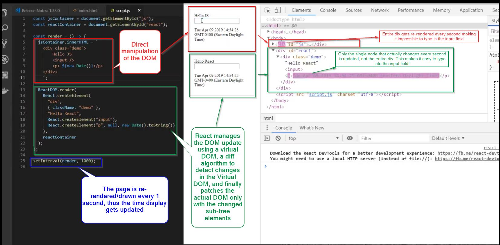

As I look at various blogs, and video courses I am amazed at how good some authors/instructors are at explaining a concept using illusrative examples that are engaging and to the point!

I came across an example in an O'Reilly's Learning site. This is part of a video series called [Learning ReactJS](https://learning.oreilly.com/videos/learning-reactjs/9781785887079) by [Samer Buna](https://medium.com/@samerbuna).

He used a simple example to illustrate the difference between

- the traditional approach of manipulating the HTML Document Object Model(DOM)
- Using React's approach of working with a virtual DOM to improve rendering efficiency and performance

I took the liberty of reproducing the code and the resulting behavior comparison between them on my computer and recorded the interaction.

<iframe width="560" height="315" src="https://www.youtube.com/embed/H-VWhLKKmSg" frameborder="0" allow="accelerometer; autoplay; encrypted-media; gyroscope; picture-in-picture" allowfullscreen></iframe>

I also attempted to show how the code snippets relate to the rendered view in the browser and how the console shows the updates.

The code can be found on [github](https://github.com/SharmaRamesh/react-virtual-dom).
